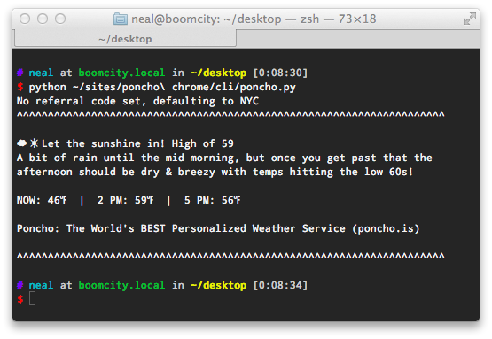
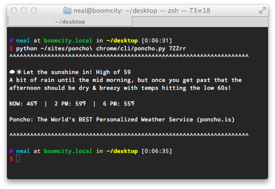
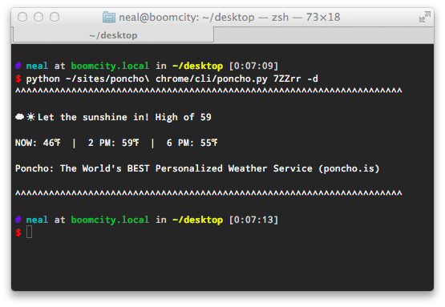

##Poncho.py

[Poncho](http://www.poncho.is) is an awesome weather service incubated at Betaworks. A few months back I wrote a [Chrome extension](https://chrome.google.com/webstore/detail/poncho/ibfheadaidbgfdoignldjdjjanfdfkfh) to view my forecast without leaving my main work environment / picking up my phone.

It worked really well, until I started spending more time in the console. That's when I remembered a post I wrote about [parsing HTML with BeautifulSoup](http://gitat.me/2013/09/26/Scrapin-Care-of-Business.html) and got to work.

**The end result is Poncho.py: the ultimate console-based weather forecast**

*Dependencies: BeautifulSoup 4 & lxml parser*

The script accepts two optional arguments: 

- Your personal referral code from the "view in browser" links you get via email, e.g XXXX from (http://poncho.is/s/XXXX). If not provided, script defaults to `RW5pQ` (NYC).
- a `-d` flag which suppresses the detailed weather description. 

I also recommend aliasing it in your .zshrc / .bashrc:
`p = "~/path/to/poncho.py <refcode>"`

Default NYC forecast:

Forecast with referral code:

Forecast with referral code & suppressed detail:

I'd love to hear what you think about Poncho.py and please feel free to contribute & fork!