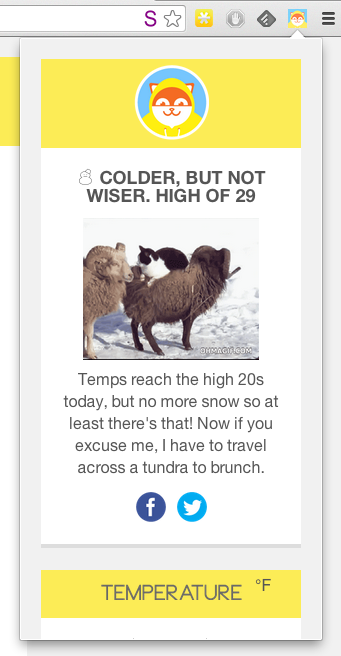
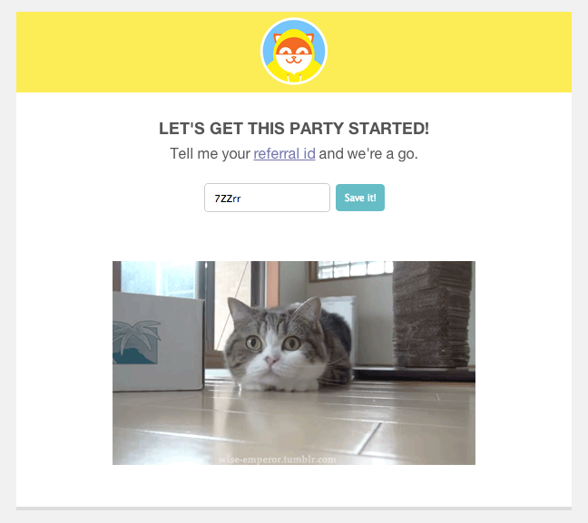

**The Poncho Chrome Extension**

[Poncho]() is the world's BEST personalized weather service. And now it's only a click away in your browser!

**Installation**

1. Follow these [instructions](https://developer.chrome.com/extensions/getstarted.html#unpacked).

2. Open the options page and enter your id. It's the part that comes after `?ref=` in your [referral link](http://poncho.is/settings). Don't forget to save!

3. Click on the Poncho icon in your toolbar.

**Why?**

Uhm, why not? Everbody loves a fun hack (and cats)!

**Misc**

Graphics by Poncho. Cats by Giphy. Code by me.

MIT License © 2014, Neal Shyam